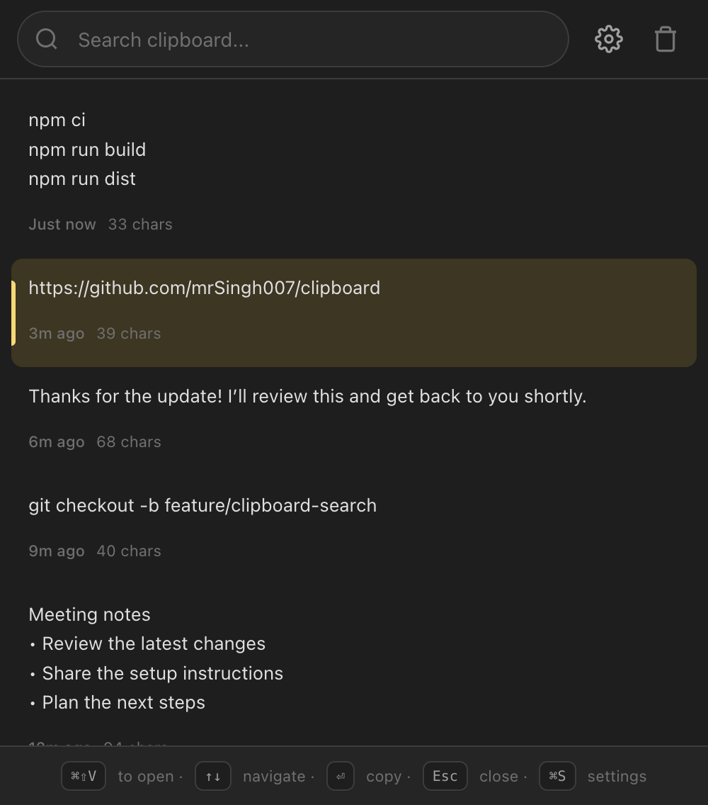

# Clipboard History

A lightweight, open-source clipboard manager built with Electron, TypeScript, and SQLite. Keep the text you copy, search it later, and reuse it without switching back through apps and browser tabs.

<p align="center">
  
</p>

*The actual app interface on macOS, shown with sample clipboard entries.*

## Why it’s useful

- Recover something you copied before another copy replaced it.
- Collect links, notes, and snippets while researching or writing.
- Pin frequently used commands, replies, or reference text for quick access.
- Search your history and copy an entry using the keyboard.

History and settings stay on your computer; there is no account or cloud sync. The app captures **plain text only**, not images, files, or rich-text formatting.

## Features

- Clipboard monitoring while the app runs, with a pause/resume option in the tray menu or settings.
- Search across saved text. Re-copying an existing entry moves it to the top without creating a duplicate.
- Pin or delete individual entries. Clear history removes only unpinned entries.
- Keep 1,000 unpinned entries by default, choose another limit, or keep unlimited history. Pinned entries do not count toward the limit.
- Configurable global shortcut and start-at-login setting. Start at login takes effect only in a packaged app.
- Local SQLite storage that survives app restarts.

## Platform support

| Platform | Status |
| --- | --- |
| **macOS** | Primary platform. macOS packaging is configured, and the build and screenshot were verified on macOS. |
| **Windows** | The runtime includes Ctrl shortcuts and guards macOS-specific APIs, but Windows has not been verified. The current build script uses Unix `cp`, so use the PowerShell steps below to try a local Windows build. |

Build on the operating system where you intend to use the app. Windows instructions are an unverified source-build path, not a guarantee of compatibility.

## Install from source

This project does **not distribute prebuilt releases**. Clone it, install dependencies with `npm ci`, build it, and install the package you create locally. The `release/` folder is local build output; the commands below do not publish a release.

### Prerequisites

- Git.
- Node.js **22.12 or newer** and npm; Node.js 24 was used for the verified macOS build.
- If installation needs to compile the native SQLite dependency, a working native build toolchain: Xcode Command Line Tools on macOS, or Python and Visual Studio Build Tools with C++ tools on Windows.

`npm ci` uses the committed lockfile. Its postinstall step rebuilds native dependencies for Electron.

### macOS

```bash
git clone https://github.com/mrSingh007/clipboard.git
cd clipboard
npm ci
npm run build
npm run dist -- --publish never
```

`npm run dist` also runs the build, then packages the app into `release/`.

1. Open the generated `.dmg` in `release/`.
2. Drag **Clipboard History** into **Applications**.
3. Launch it from Applications. It starts in the menu bar with its history window hidden.
4. Use the menu-bar icon → **Open History**, or press **Cmd+Shift+V**.

Local builds are not configured for signing or notarization. If macOS blocks your build, review the message in **System Settings → Privacy & Security** and approve the app only if you trust the source you built.

### Windows (experimental, PowerShell)

The standard `npm run build`, `npm start`, and `npm run dist` scripts depend on `cp`, which is unavailable in a standard Windows shell. These equivalent PowerShell steps compile and copy the files before invoking the packager directly:

```powershell
git clone https://github.com/mrSingh007/clipboard.git
cd clipboard
npm ci
npx tsc -p electron
npx tsc -p renderer
Copy-Item renderer/index.html, renderer/style.css -Destination dist/renderer/
npx electron-builder --win nsis --publish never
```

After every command succeeds, run the generated installer `.exe` in `release/`, launch **Clipboard History**, and open history from the system tray or with **Ctrl+Shift+V**. Windows packaging and installation still need testing on a Windows machine.

## Using the app

1. Copy some text while monitoring is enabled. The clipboard contents already present at startup are skipped; newly copied text is saved.
2. Open history using the tray menu or global shortcut.
3. Type to search, then use **↑ / ↓** to select an entry and **Enter** to copy it, or click an entry.
4. The window hides. Paste into your destination app with **Cmd+V** or **Ctrl+V**. Choosing an entry copies it; pasting is a separate step.

Hover over an entry to reveal its pin and delete buttons. Open settings with the gear icon or **Cmd+S** on macOS / **Ctrl+S** on Windows. Click the shortcut setting and press a new key combination to change it.

**Esc** hides the window. Closing the window leaves monitoring running; choose **Quit** from the tray menu to exit. If the global shortcut is already used by another app, open history from the tray and change it in settings.

Clipboard text may include sensitive information. Pause monitoring before copying anything you do not want saved, and delete unwanted entries. Saved history is not encrypted by the app.

## Development

After `npm ci`, on macOS:

```bash
npm start
```

This compiles and launches the app. There is no development server or automatic reload. On Windows, run the compilation and `Copy-Item` commands above, then `npx electron .`.

- `npm run build` — compile main and renderer TypeScript and copy static UI files into `dist/` (currently requires Unix `cp`).
- `npm run dist -- --publish never` — build and package locally into `release/`.
- History lives in `clipboard.sqlite` in Electron’s app-specific user-data directory; settings use `electron-store` in the same directory.
- A reduced history limit is applied when the next clipboard entry is recorded.

```text
clipboard/
├── electron/       # Main process: window, tray, monitoring, database, settings, IPC
├── renderer/       # Plain HTML, CSS, and TypeScript UI
├── shared/         # Types shared by the main process and renderer
├── assets/         # App and tray icons
├── docs/images/    # README screenshot
├── dist/           # Generated compiled app (ignored by Git)
└── release/        # Generated local packages (ignored by Git)
```

## License

[MIT](LICENSE)
